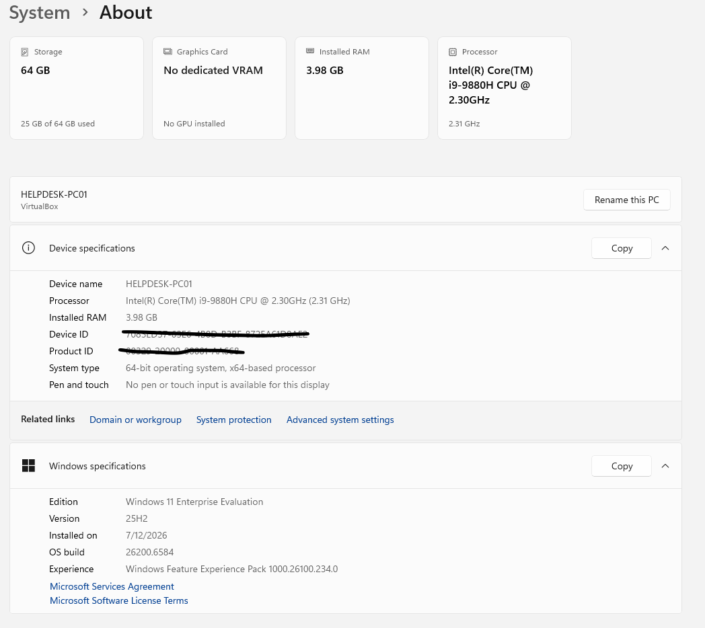
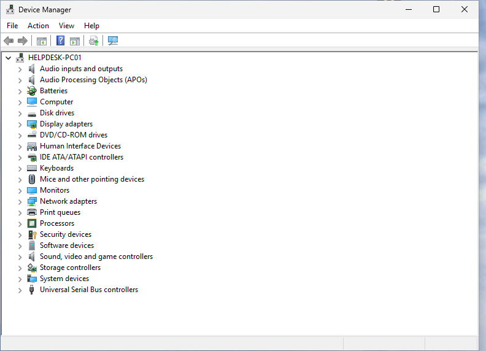
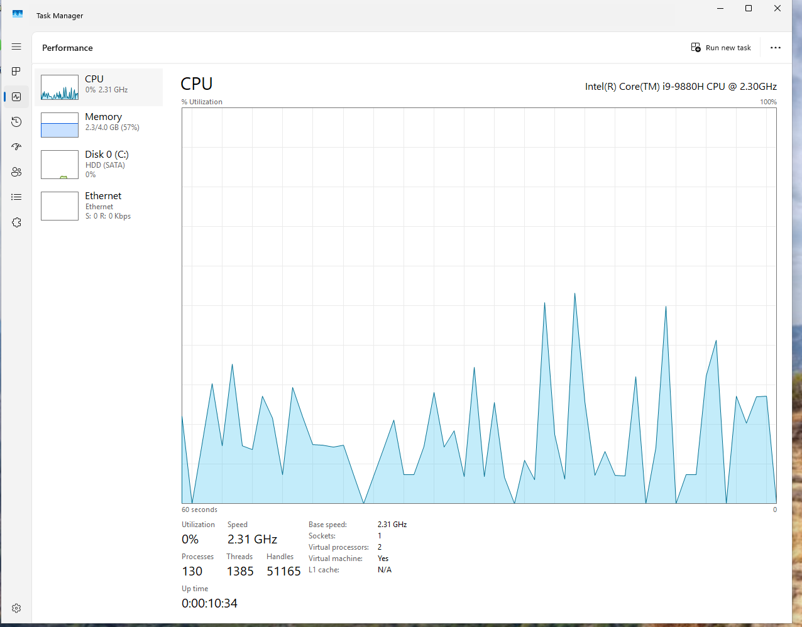
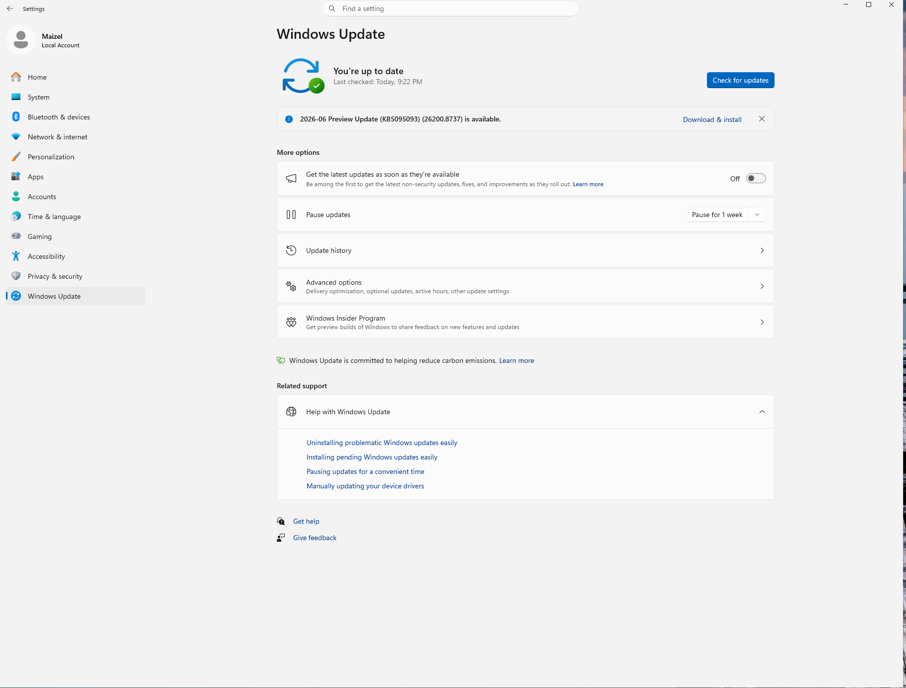
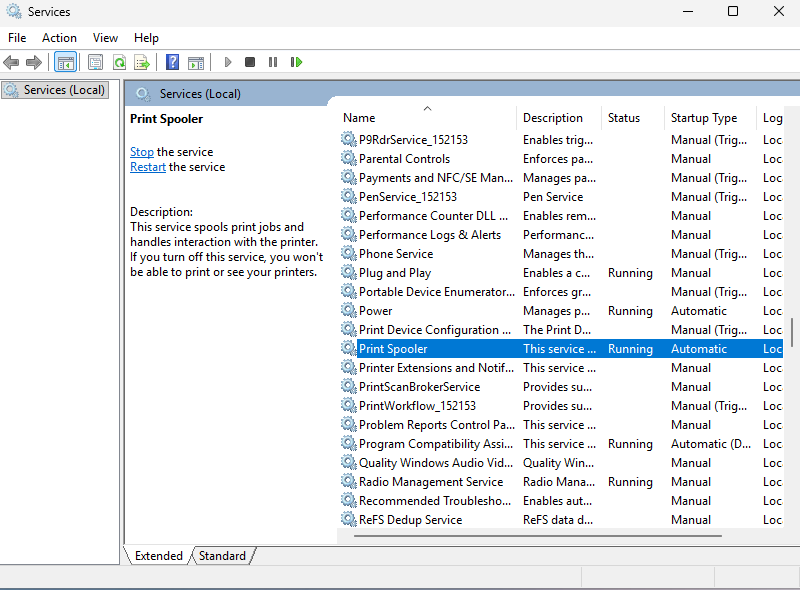

# Lesson 1 - Verifying a New Workstation

## Objective

Verify that a newly installed Windows 11 workstation is functioning properly before assigning it to an employee.

## Tools Used

- Settings
- Device Manager
- Task Manager
- Windows Update
- Event Viewer
- Services

## What I Verified

- Windows booted successfully.
- The workstation name is HELPDESK-PC01.
- Windows 11 Enterprise is installed.
- No hardware issues were identified in Device Manager.
- Task Manager opened successfully.
- Windows Update was checked.
- Event Viewer opened without issues.
- Services console opened successfully.

## What I Learned

(Write 3–5 sentences in your own words.)

## Questions I Still Have

(List anything that confused you during the lesson.)

## Verification Results

- Windows 11 booted successfully.
- The workstation name was confirmed as HELPDESK-PC01.
- Windows 11 Enterprise was installed.
- No yellow warning icons were observed in Device Manager.
- Task Manager displayed normal CPU, memory, disk, and network activity.
- Windows Update was checked.
- Event Viewer opened successfully.
- The Print Spooler service was located in Services.

## Screenshots

### Windows Desktop

### System Information

### Device Manager

### Task Manager

### Windows Update

### Event Viewer

### Services

## What I Learned

Write three to five sentences in your own words about what each tool is used for and what you learned while checking the workstation.

## Questions I Still Have

List anything that was unclear or anything you want to learn more about.
