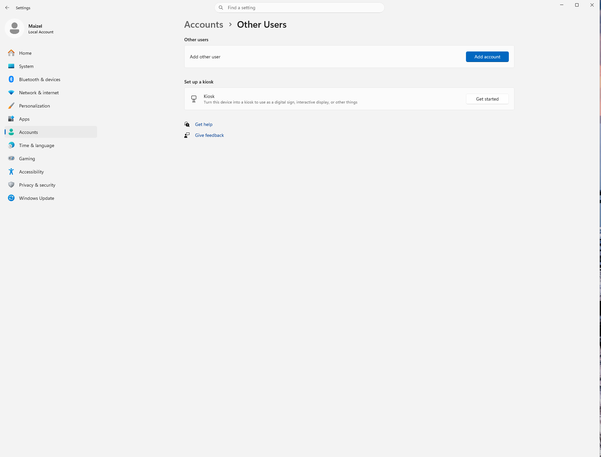
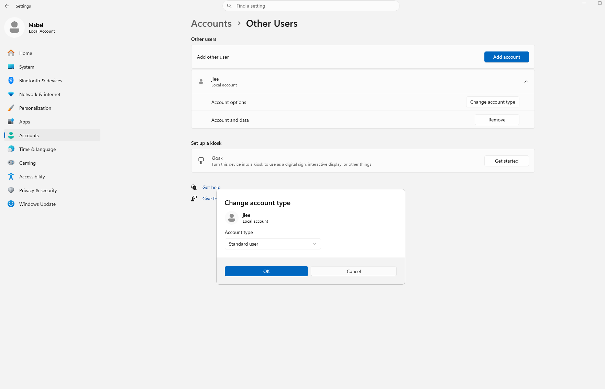
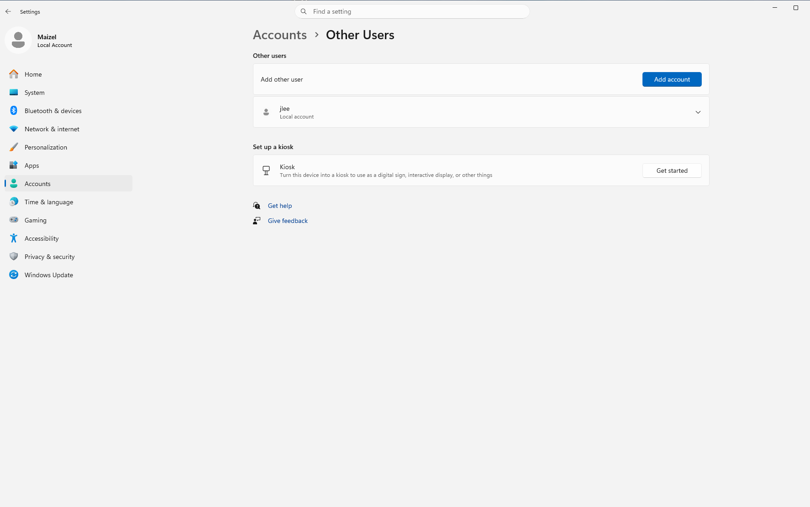
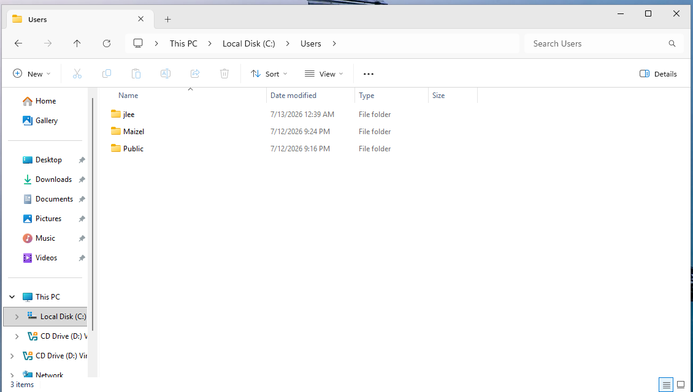

# HD-002 – New Employee Onboarding

## Ticket Information

**Technician:** Maizel Jurado

**Company:** Northstar Technology Services (Fictional)

**Priority:** Medium

**Category:** User Account

**Status:** Completed

---

## Request

Human Resources requested that a workstation be prepared for a new employee.

Employee: Jordan Lee

Username: jlee

---

## Work Performed

- Created a new local standard user account.
- Verified the account appeared under Other Users.
- Confirmed the account type was Standard User.
- Signed in as the new user to generate the Windows profile.
- Verified the user profile was created under `C:\Users`.
- Confirmed the user required administrator approval for administrative tasks.

---

## Verification

The new user successfully logged into Windows and the workstation is ready for employee use.

---

## Skills Demonstrated

- Windows User Management
- Desktop Support
- User Verification
- Principle of Least Privilege
- Documentation

# HD-002 – New Employee Onboarding

...

## Evidence

### Before Creating the User

---

### User Successfully Created

---

### Account Type Verified

---

### User Profile Created

